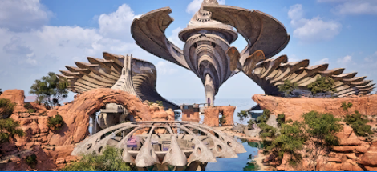
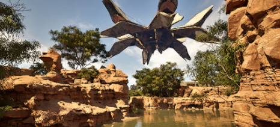
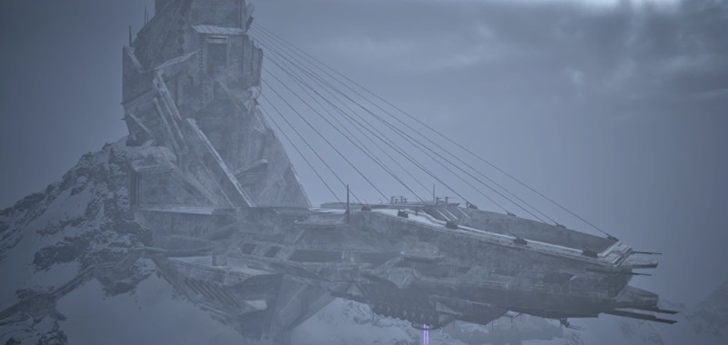

It is generally difficult for me to single out favorites: favorite film, favorite music album, favorite food. But when it comes to video games, that become very easy. The Talos Principle has long occupied that place, and has only been replaced by its sequel.
This post will allow me to ramble about it and its fantastic ideas. It will serve as an excuse for me to replay it for the nth time and organize my thoughts, and if I can convince even one person to play it that will be worth it.



# Some presentation

{}
This is a spoiler free zone. You will be warned when it gets more spoilery.
{}

Let me first present those games, and hopefully try to convince you to abandon this page and go play both games right now.

The Talos Principle I and II are puzzle games, released in 2014 and 2023 respectively and developed by Croteam, a croatian studio known for the Serious Sam shooters. They are available on most platforms and the first opus benefited from a remake in 2025 with improved graphics, additional content and accessibility options [check].

Gameplay wise, you will have to solve puzzles in 3D environments, using various tools. Core gameplay revolves around pressure plates, jammers, fans and redirecting colored lasers around. These are not the only mechanics though and the sequel expands significatively upon this with teleporters, RGB converters and more.
The puzzles are really good: many will give you that eureka moment, sometimes because you finally have found the solution after some head scratching but quite often because finding the solution entails understanding something about the game mechanics.
The difficulty is well designed and will ramp up nicely. Note that the sequel is not more difficult than its predecessor, mostly owing to a lot of new mechanics. The most tenacious players will enjoy some tough optional puzzles, especially in the DLCs.



The first Talos takes place in old civilizations ruins (part of it is based on the beautiful roman ruins of [Ostia Antica](https://anticaostia.it/en/), some of which were scanned), giving the game a unique, lonely atmosphere. The second game offers some superb brutalist architecture. The music of both games is composed by Damjan Mravunac, and I am not capable enough with words to even begin to tell you how good it is. It oozes atmosphere from everywhere, and listening to it never fails to conjure the many emotions the games have brought to me over the years.

The story is told in a non-linear fashion, mostly through scattered texts and audio logs, though the sequel has lots of dialogues and a more conventional plot. 
If the gameplay alone already makes them great games, the writing elevates them to absolute gems. Both games tackle deep philosophical questions and engage the player in thinking about them. They will ask to formulate opinions and will scrutinize your every responses. This way of engaging with the player has aptly been described as [playtesting philosophy](https://playtestingphilosophy.neocities.org/) by Megan Steiner in her master thesis on the first game. It never fails to be fun, and manages to never be pompous.

The subjects themselves are quite fascinating to me: Verena Kyratzes -- one of the writer -- puts it concisely as "Talos 1 [is about] what makes a human being a human being, Talos 2 is what makes a civilization a civilization".
If the first Talos was already fascinating to me, as I always had something for Pinocchio-like stories, I find the second one even more *important*. It both addresses issues related to climate change and the future of humanity, and puts forward arguments that I feel should be heard far and wide.

Even though I barely said anything about the story of the games, I cannot really discuss further the first Talos without spoiling some of the experience. I typically don't think that spoilers will ruin something for me, but I think Talos 1 is best enjoyed without knowing anything about it, especially the first hour or so.
A lot of the pleasure can be found in piecing together what is happening and interpreting what the different characters tell you. If you enjoy puzzles and philosophy, please do not hesitate and jump on it, the first game is far from expensive and can run on pretty old machines so you have no excuse.

# Talos 2 premise

{}
You are entering the spoiler zone. I will avoid to discuss anything beyond the second hour or so of Talos 2 and will try to keep it vague enough not to spoil Talos 1.
If you want to keep it absolutely fresh, well go play the games you will thank me anyway.
{}

Talos 2 takes place far in the future. Mankind did not survive climate change and has long been extinct. They did manage to create a true artificial intelligence before going out. These robots consider themselves humans, successors to their organic predecessors; a reminder that despite of the sci-fi stuff, the game is about humanity.
In the derelict ruins of their ancestors, a small group of (new) humans is building a city they have called New Jerusalem[^newjerusalem]. They have a goal -- **the** goal, in their words -- to build a thousand humans, and not a single more, to live in that city, walled from the exterior and kept in balance with the environment. They are keen on not reproducing their ancestors mistakes.
If the first game --- and this is understandable given its subject --- did not give definitive answers, the second one is very much opinionated. It still gives arguments in favor and against, but is clearly biased towards one side.

**The whole game is going to try to prove that "the goal", human stagnation, is a big mistake. It will argue in favor of human expansion and growth, and will give a deeply humanist rebuttal of degrowth.**

- This does not mean the game is in favor of unfettered capitalism, far from it. It tries to shed a more humanist and hopeful light on our current situation, without ignoring issues.
- The far-future setting of the game reflects its themes. The game is not really concerned into what we should be doing right now to counter ecological and societal problems. Its sights are set further away: where do we see ourselves a century from now? What kind of civilization do we want to be?

## The story

When the game begins, you are born as the thousandth human in New Jerusalem. You are thus the last human to be created. Before you can contemplate of the full moral implication of this, you are invited to attend a celebration: the city has fulfilled its goal.
This is all is cut short by a strange apparition. A huge hologram, presenting himself as Prometheus, is declaring that the city is awaited to complete his trials, in order to obtain a great power. He is in turn interrupted by a second figure, Pandora, that berates him and puts him in chains before warning that this power is not for mortal to wield.

New Jerusalem does not have the technology to create such holograms, and as far as they know they are alone on this planet. This perplexing scene thus calls the city to investigate. The origin of the signal is tracked to a neighboring island[^tempest], once a prospect for exploration before the city started to cut down on such expeditions.
You are invited on the operation by its leader, with the hope that you will be able to give a fresh perspective on the whole thing.

After a short stroll throughout New Jerusalem, you embark on an helicopter towards the island with 4 others.
In its center, your team finds an almost impossibly gigantic pyramid, dubbed the mega-structure. It becomes obvious that you will find the answers inside, and possibly the technology that made its construction possible. A game changer for humanity, but with risks. Who knows of its purpose? of the dangers posed by this technology?



The mega-structure is connected to 12 other regions on the island, each presenting a smaller but still impressive structure surrounded by puzzles that you will have to solve to obtain entrance to the pyramid.
I will stop there, but the story has more twists and turns for you.

## The expedition team

You explore the island with other companions. Beyond being well written and endearing characters, they also crystallize different opinions about the mega-structure and the situation of New Jerusalem. Allow me to present the members and their ideas succinctly.

**Byron** is the team leader. One of the first human created, he was there in the first days of New Jerusalem that were full of dangers and excitement about the future. He holds deep humanist beliefs, and dislikes what New Jerusalem has become though has failed to step up and steer the city on a different path. He wants for humanity to explore, not close in on itself. He did not named himself after the poet, but the explorer Robert Byron.

**Alcatraz** is the foil to Byron. He is the voice of reason, and is very wary of the potential dangers of the mega-structure. Where Byron can be brash, Alcatraz is cautious. The two of them are close friends, and they respect each other opinions even though they have strong disagreements.

**Melville** is an old, cranky engineer, named after the artic explorer George W. Melville. She is cautious of the mega-structure as she would be of any piece of technology, but her position as one of the chief engineer of the city gives her perspective on the potential of that new technology.
She believes the frequent energy and material shortage the city suffers are as much dangerous as the mega-structure could be.

**Yaqut** is the youngest of the team, after 1k of course. He is a scavenger of resources, in spite of the city not pushing for expeditions for many years. Despite being adventurous, he is much more cautious of the mega-structure than Byron for instance, maybe owing to him being born much later at a point where New Jerusalem had long been closing in on itself. He is named after Yaqut al-Hamawi (1179--1229), an historian and geographer.

**1k** is the player-character. He[^1kgender] displays a certain knack for puzzles, a running-gag in the game being that the other team members are not that interested in them, or in the case of Yaqut pretty much incapable of solving them. The player is able to choose their own opinion about the mega-structure and the situation of New Jerusalem.

Those are the character you will interact the most, but no the only ones. The expedition members stream their adventures to the rest of the city with which you will be able to communicate through an internet forum. People will express there different opinions on the state of the expedition, of the city, will share painting and poetry.
You can voice your opinion in those conversations, and doing so may sway the public one way or the other.

## New Jerusalem

{}
You are now knee deep in spoilers. I will not discuss the plot further, but I will divulge some aspect of the universe you may want to experience for yourself.
{}

I have mentionned the "situation" of New Jerusalem[^newjerusalem] without explaining much about it.
You can visit parts of New Jerusalem before going on the expedition, and then a second time during a kind of intermezzo. You will be able to interact with some of its population, and explore some landmarks.
You will notice that most of those are either museums or monuments dedicated to (new and old) human history.
Even most of the new art is commemorative, as exemplified by the Gehenna Memorial Pavilion that references the Road to Gehenna DLC of the first game.
This is deplored by Byron[?] later, as he argues the whole city *is* a museum.

The city's biggest undertaking is probably its dome. A large glass ceiling enclosing the whole city whose purpose is --- from its chief architect Wren (the game is not always subtle with names) --- as much to protect New Jerusalem from the world as it is to protect the word from New Jerusalem.
Ironically, the dome is not yet finished due to shortages of materials that could be found outside the city.

The shortages are another defining feature of the city. Despite being built next to an hydroelectric dam, the city suffers from frequent hiccups in its power grid. This has led to city to cut "frivolous" activities, such as a cinema. This has already caused accidents in the transport system, which could have more serious consequences if it reoccurs. Melville also warns that if no investments are made in maintaining the existing power supply (by obtaining materials outside of the city), available energy could wane dangerously. New humans may have to stay in sleep mode longer.



Those issues are discussed and opposed by some of the city population, despite the government being an hard defender of *the goal* (a thousand human and not one more). For instance 1k has the opportunity to sign a petition at a small protest demanding action for the energy issues of the city.
Some are less vocal and their wish for human expansion and its celebration are rather expressed through art: hopeful poems or artistic rendering of ancient cities (like Paris and New-York).
But even the most ardent protesters avoid questioning too frontally the goal, often out of reverence for its architect. The first new human, Athena, enunciated the goal before disappearing many years ago. She then turned into a nearly religious figure, called The Founder whose teachings, including the goal, must be observed.
The inability of the citizens of New Jerusalem to bring about any change to their situation is a subject in itself, which we will discuss later.

# Extreme core ideas

There are two additional characters that I can discuss without spoiling the plot too much. They are of special interest because they express some arguments in a very clear, straightforward manner.

## Lifthrasir

Lifthrasir[^lifthrasir] is a famous odd figure in New Jerusalem. He travels alone outside the city during dangerous expeditions. Over the years this has earned him admirers, much to his chagrin.
Some time before the events of the game, he left with followers on his most daring expedition yet. They passed through the island where he left a number of [audio logs](https://taloswiki.org/wiki/Lifthrasir%27s_audio_logs) in which he discusses philosophy.
He puts forward humanist arguments and beliefs, perhaps the most extreme in the game. Let us look at some of them.

### Progress

First we should address his occupation. Leaving the city to be alone in nature could be seen as some kind of misanthropy but he argues it is, in fact, quite the opposite.
To him, experiencing the harshest deserts and coldest peaks only makes him appreciate all the more the comfort of the city.
Perhaps surprisingly, he seems to dislike nature. Or maybe more precisely he does not appreciate it the way we could expect him to. He deems nature is only "mindless chaos and eternal conflict", living things only striving to survive. "Nature is our most powerful and least honorable enemy".
This is why he is very strongly opposed to the romantic idea of going back to a simpler, more natural state.
He thinks it an idea coming from someone that never had to truly experience the dangers of nature.

One  document from the game illustrates well the loathing of that idea. [how_it_was_before](https://taloswiki.org/wiki/How_it_was_before) features a fictional interview of an old woman.

> She tried to explain how much time she spent every single day on utterly mind-numbing activities, like hauling water from the well, and how radically everything changed when their area was finally connected to the electrical grid. "Before, there was no time to live," she said. "No time to be free. Only work, work, work."
>
> [...]
> 
> "The past is bad," she said with some finality. "Let it be."

This is the first important idea presented distinctly by the game: **going back to a fantasized, simpler time is a dead end**. It is forsaking not only comfort but also safety. It is rooted in idealism and ignores the goodness that progress has brought.

### Beauty

The second very striking idea of Lithrasir relates to the absence of inherent beauty in the universe.
To him, there is nothing inherently beautiful in the world. Nothing carrying meaning. This is best exemplified in his second audio log where he describes an encounter he had.

> While exploring the forest, I came across a sight of primal force.
> A beautiful stag, standing on a hill, silhouetted against the setting sun.
> It appeared like a messenger from some divine natural power, perhaps from Gaia herself.

One would qualify such a moment as containing beauty, even something of a divine message.
But to him, nothing is there.

> If we could speak to the stag, what wisdom would it have to offer? The answer is: none. The stag is an animal of overwhelming stupidity, driven only by fear, hunger, and lust.

This is not to say that there is nothing of value here. Lithrasir says in another audio log that "...in these green hills, I see tremendous potential for transformation and spiritual awakening".
But the things we witness, the stag, the sunset, the rocks, have no inherent meaning or beauty. It is only because we witness it, as conscious beings, that we can *impart* meaning and beauty to it.

This idea gives a first corollary. Without humans, the universe loses meaning and beauty. This makes humanity precious, something to preserve.
This is expressed by another character (that I will omit naming to avoid more spoilers)[^noema_document]:

> Consciousness is rare, unlikely... but it's also the foundation of everything else. Without us, there can be no meaning. Without someone to perceive it, the beauty of the universe is pointless.
> But that shouldn't make us arrogant. No, in fact it means we carry a tremendous responsibility. We are the light of the cosmos, and if we go out... there will be nothing but a cold, dark machine. 

Which also results in the following argument: the more humans there is, the more beauty there can be. It becomes our duty to spread throughout the cosmos.
This starts to feel a bit outlandish, and one must be blind to the many problems humans cause to the earth and to each other today not to have at least one objection.
This claim to me does not hold water. And the game does not seem to try to consolidate it by addressing the obvious critique we could make. You could argue that this is a weakness on the game part, and it very well could be. But I think it also turns into a statement: that we should not justify 

### Anger

See the vocabulary: nature is an enemy

But where to direct this anger? Nature is described as a force to be wary of. But all issues touched upon (whether in game like the energy and material shortages or closer to real life like climate change) are caused by humans.

## Straton of Stageira

The Talos principle (the idea, not the game).

We can apply it to the city.
If a city is a machine, and it does not fulfill its purpose, then we ought to repair or change it.

Indecision in history. I don't really know what to say. Maybe the game falls short? I have to replay it.

# Environmental storytelling

Something is to be said about the environments of the game.
The island where most of the game takes place offers a variety of natural environments; a forest, a grassy plateau, artificial oases, a cliffed tropical coastline, a snowy peak, a flooded valley and various marshes and wet lands.
Each region features an artificial structure of impossible architecture, surrounded by about a dozen puzzles, each one inside an open building. The player is guided along paths from one puzzle to the next but is incited to explore to find secret puzzles or text and audio documents.

[example of puzzle buildings]

All locations in the game showcase the human ability to modify their environments, from the futuristic city of New Jerusalem to even the seemingly wilder parts of the island.

## Structures and buildings

Each region shows obvious human influence through its central structure and the surrounding puzzle buildings.
Most structures are towers[^phallism], but can also evoke some kind of spaceship, as in the case of the , the , or the .
The idea of space exploration is explicitly stated in the high plain region. This is a grassy plateau featuring the largest structure of all regions (after the mega-structure). It is a series of non-concentric rings, spanning the whole area, supported by towers.
It is revealed by Melville that it is based on a spaceship port design.
All those symbols of space outreach are to contrast with the dome of New Jerusalem, that visually prevents such upward stretch[^nj_tower].

The puzzle buildings have an unmistakable brutalist architecture. This style from the 50s and 60s, beyond allowing Croteam to flex their environmental design abilities, has been associated with modernism and socialist utopias.
This is very much intended, the writers citing the hopeful science-fiction from the 60s (like Star Trek, whose some interior designs reminisce as well) as a direct influence.
This is far from the only game where brutalism pops up, and it is generally associated with totalitarianism and state control; Dishonored, Wolfenstein, or even Control (it's in the name)[^brutalism].
However the buildings here are very open, and the larger structures do not seem to bear down on the viewer. The developers have carefully avoided the more stifling elements of brutalism.
The human is still at the center of it, demonstrated by the many statues of human figures present in every levels.

## Anthropic hills



The large structures celebrating human accomplishment perhaps culminate in the so called "anthropic hills" region. The player will understand its name right away as the craggy hills have been filled by gigantic stone statues of humans.
First reactions might include awe, but also creepyness, both of which are expressed by the other team members.
There is a stark contrast between the statues around the main structure --- striking a pose in action, and very reminiscent of soviet-era statues --- and the statues around the hills.
Most are in contemplation or introspection. Multiple statues are huddled up, holding their knees and looking at the ground. This may stir feelings of sadness, melancholy and regret.

I must admit that it is only exploring those hills that I realized how dramatically humans have changed the island. This is perhaps due to the very apparent futility of the statues. They are purely ornamental, whereas most puzzle buildings stay relatively discreet and even the largest structures suggest to have some practicality.
The player is confronted with the fact that the landscape has been very deliberately, profoundly affected.
The human subject also hints at the egotistic tendencies of the humanist project.

I would argue this landscape conjures emotions that the player might feel towards the new technology of the mega-structure. At this point in the game (the area becomes available towards the end), the player has felt curiosity and excitement at the possibilities offered by it, but also dread at the responsibilities it gives, and fear and melancholy at the dangers that have been established as very real.

## Ecosystem engineering

Some regions have had extensive modifications to their ecosystem.
The grassland rings, the first region visited, is inside an artificial lake surrounded by concrete.
The circular oasis is obviously artificial, being dug out in the middle of the desert.
The verdant canyon seems natural at first but is revealed by other expedition members to be artificial in nature. The canyon, the water, and life therein have been created using the technology of the mega-structure.

This ability to terraform ecosystems is not valued by the game as a moral wrong or right. Through the document [Ecosystem engineers](https://taloswiki.org/wiki/Ecosystem_engineers), the game affirms that this behavior is a natural process.
This circles back to the ideas exposed by Lithrasir, humans are fighting for their survival as any other organism.

> Cutting down swathes of trees for their building projects, thoughtlessly causing radical changes to large environments and forcing local species to adapt to their artificial habitats [...].
> 
> Humans? No, I'm talking about beavers.
>
> [...] we too are ecosystem engineers, and we too benefit some species while harming others. Everything about this is completely natural, including the damage to other species.

This is not presented as always intentional. The game features three region that are explicitly being lost to the sea: the western delta, the lost marshes, and the flooded valley.
This is impacting the player very directly: they will have to wade through the level, being mindful of places where the waters are too deep.
The consequences of climate change, even centuries after human extinction, are being strongly felt in very tangible ways.

[example of wetland, the flooded valley maybe?]

However, those are not the only levels with significant amount of water. There are 5 out of the 9 remaining levels where the player will be knee-deep in water. We already mentioned the grassland ring, the circular oasis and the verdant canyon, to which we add the eastern wetlands and the southern coast (both natural). This reinforces the idea that human modification of ecosystems is a natural process.

# Acting change

[^newjerusalem]: A name the evokes heaven on earth. It possibly alludes to the poem [And did those feet in ancient time](https://en.wikipedia.org/wiki/And_did_those_feet_in_ancient_time) by William Blake, whose poetry is referenced a lot in both games.
      It exhort humans to create heaven on earth and questions the industrial revolution ("And was Jerusalem builded here, Among these dark Satanic Mill?").

[^tempest]: The island setting is one of the many references to The Tempest.

[^1kgender]: 1k's gender is unspecified in the main game wherein he communicates only in text form. In the Isle of the Blessed DLC however, 1k ends up choosing a masculine voice.

[^lifthrasir]: Named after Lífþrasir, one of the two human that survives Ragnarök and will repopulate the world.

[^noema_document]: <https://taloswiki.org/wiki/Noema_1C15_5358> (spoiler alert)

[^phallism]: All those towers are inevitably phallic, but it is interesting to note that the tower from the flooded valley level has, to me, a pretty yonic vibe.

[^nj_tower]: New Jerusalem does have a tower at the center of the dome, but it is completely contained by it. The dome has an opening but not large enough to encompass the girth of the tower, suggesting a constrained city with a possibility for emancipation. 

[^brutalism]: https://www.eurogamer.net/how-brutalism-has-shaped-games 
